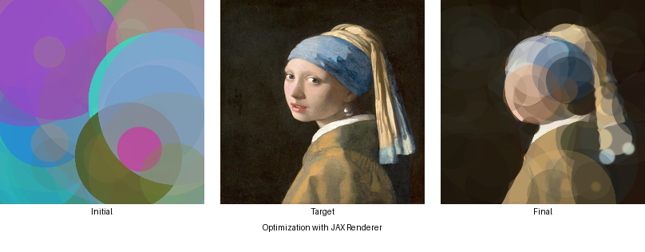
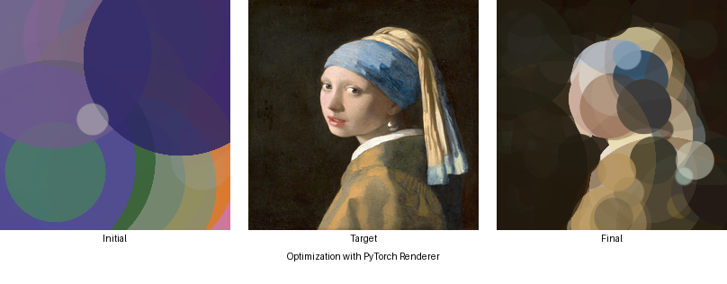
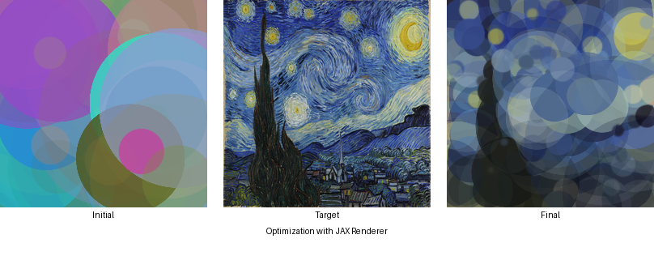
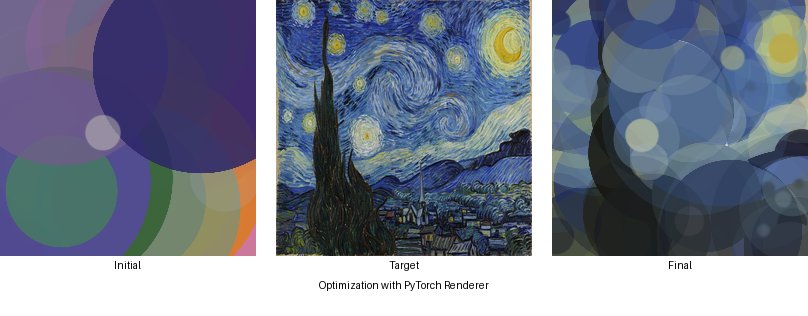
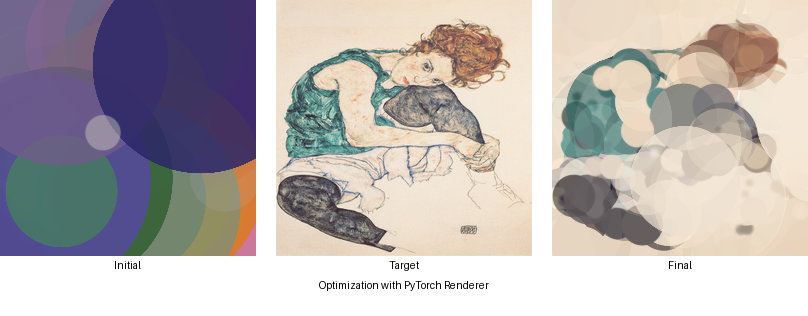
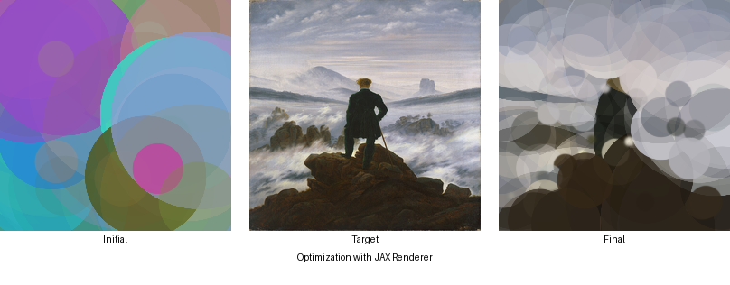

# Minimal Differentiable 2D Renderer

This repository provides a minimal, fully-differentiable 2D renderer for circles, implemented in both JAX and PyTorch.

As an application, we implement an optimization loop that uses gradient descent to adjust the properties (position, size, color, alpha) of hundreds of circles to match a target image.

## How It Works

The rendering process is straightforward:

1.  **Canvas and Coordinates**: An empty canvas and a grid of pixel coordinates are created.
2.  **Circle Parameters**: Each circle is defined by 7 parameters, representing its center coordinates (x, y), radius, color (r, g, b), and transparency (alpha). These are initially random logits.
3.  **Alpha Compositing**: The circles are rendered sequentially onto the canvas. For each circle, an alpha map is computed for the entire canvas, where the alpha is highest at the circle's center and fades to zero at its edge. The final color of each pixel is determined by alpha-compositing the circle's color with the color of the canvas beneath it.
4.  **Differentiation**: All operations are differentiable and we can compute the gradient of a loss function (like MSE between the rendered and target images) with respect to the circle parameters. This allows us to use gradient-based optimization to find the best circle parameters for any objective.

## Benchmark Results

The `benchmark.py` script was run to generate images parameterized by 2048 circles that closely resemble some of my favorite paintings. This simple optimization task also allows us to compare the performance of the JAX and PyTorch implementations.

The results show that while both frameworks achieve a similar final loss, the JAX implementation is significantly (roughly 6x) faster.

### Visual Comparison
See more of the results in the `benchmark_outputs` directory.

**Image: `girl_pearl_earing`**




**Image: `starry_night`**




**Image: `schiele`**



**Image: `sea_of_fog`**



### Performance Table

| Image              | Framework | Time (s)  | Final Loss |
|--------------------|-----------|-----------|-------------|
| christ_desert      | JAX       | 45.3037   | 0.014149    |
| christ_desert      | PyTorch   | 281.0500  | 0.015799    |
| girl_pearl_earing  | JAX       | 44.8683   | 0.014140    |
| girl_pearl_earing  | PyTorch   | 280.6604  | 0.018814    |
| lunatic            | JAX       | 44.9013   | 0.011778    |
| lunatic            | PyTorch   | 280.6434  | 0.012052    |
| sea_of_fog         | JAX       | 44.8837   | 0.013475    |
| sea_of_fog         | PyTorch   | 280.6435  | 0.020736    |
| starry             | JAX       | 44.9087   | 0.032658    |
| starry             | PyTorch   | 280.6481  | 0.036874    |
| american_gothic    | JAX       | 44.8873   | 0.019800    |
| american_gothic    | PyTorch   | 280.6789  | 0.020764    |
| schiele            | JAX       | 44.9098   | 0.029068    |
| schiele            | PyTorch   | 280.6884  | 0.021825    |


## Usage

### Setup

To get started, clone the repository and install the required dependencies.

```bash
git clone https://github.com/your-username/differentiable-renderer.git
cd differentiable-renderer
pip install -r requirements.txt
```

### Running the Benchmark

You can run the benchmark on your own images. Place your images in the `images/` directory and run the script:

```bash
python benchmark.py images/image1.png images/image2.png
```

The output images and a results table will be printed to the console and saved in the `benchmark_outputs/` directory.

### Using the Renderer

The `example.ipynb` notebook provides a simple walkthrough of how to use the renderers and compute gradients. You can run it in a Jupyter environment:

```bash
jupyter notebook example.ipynb
```

or simply run it on Colab.

## Future Work

This project is a starting point, and there are many ways it could be extended:

-   **More Primitives**: Extend the renderer to support other shapes like ellipses and polygons.
-   **PyTorch Performance**: The PyTorch implementation can probably be accelerated by proper compilation.
-   **Improved Benchmarking**: The benchmark could be made more robust by tuning hyperparameters (softness of the renderer, learning rate, number of steps), testing different optimizers, or running multiple trials.
-   **Perceptual Loss Functions**: Instead of MSE on RGB values, using a perceptual loss (like LPIPS) or calculating loss in a different color space (like HSV) could lead to visually more appealing results. You can even connect it to a pretrained image classifier.
-   **Bottom-up Evolution**: In the benchmark task, instead of fixing the number of circles from the start we can selectively add them in batches and in "appropriate" positions and then refine them with optimization. This could lead to more accurate and interesting reconstructions.

## Credits

-   The code for project was inspired by the blog post [Art Class with Leibniz](https://www.peterstefek.me/art-class-with-leibniz.html) which I highly recommend that you check out!
-   The code and documentation were developed with assistance from Google's Gemini.

## Citation

If you use this work in your research, please cite it as follows:

```bibtex
@misc{differentiable-renderer-2025,
  author       = {Saeed Hedayatian},
  title        = {A Minimal Differentiable 2D Renderer},
  year         = {2025},
  publisher    = {GitHub},
  url          = {https://github.com/conflictednerd/differentiable-renderer}
}
```